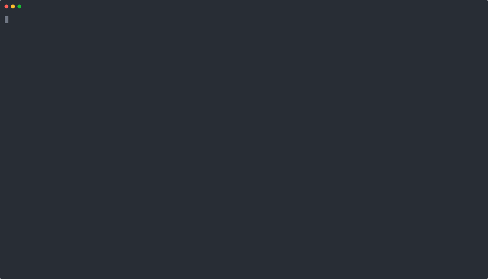

# Docker April 2026

## Lab - Installing Docker in Ubuntu
```
# Add Docker's official GPG key:
sudo apt update
sudo apt install ca-certificates curl
sudo install -m 0755 -d /etc/apt/keyrings
sudo curl -fsSL https://download.docker.com/linux/ubuntu/gpg -o /etc/apt/keyrings/docker.asc
sudo chmod a+r /etc/apt/keyrings/docker.asc

# Add the repository to Apt sources:
sudo tee /etc/apt/sources.list.d/docker.sources <<EOF
Types: deb
URIs: https://download.docker.com/linux/ubuntu
Suites: $(. /etc/os-release && echo "${UBUNTU_CODENAME:-$VERSION_CODENAME}")
Components: stable
Architectures: $(dpkg --print-architecture)
Signed-By: /etc/apt/keyrings/docker.asc
EOF

sudo apt update

sudo systemctl enable --now docker
sudo systemctl status docker
sudo usermod -aG docker $USER
docker --version
docker images
```

## Lab - Downloading docker images from Remote Registry to Local Registry

Downloading Docker Image from Docker Hub Remote Registry
```
docker pull ubuntu:latest
docker pull mysql:latest
```

Listing images from your local docker registry
```
docker images
```

Demo


## Lab - Create a mysql docker container

Listing images from your local docker registry
```
docker images
```

Create the mysql container and run it in the background
```
mkdir /home/jegan/mysql
docker run -d --name mysql --hostname mysql -v /home/jegan/mysql:/var/lib/mysql -e MYSQL_ROOT_PASSWORD=root@123 mysql:latest 
```

List all running containers
```
docker ps
```

Get inside the mysql container shell, type root@123 as password when it prompts
```
docker exec -it mysql /bin/sh
mysql -u root -p

SHOW DATABASES;
CREATE DATABASE tektutor;
USE tektutor;

CREATE TABLE users ( id INT AUTO_INCREMENT PRIMARY_KEY, name VARCHAR(250), email VARCHAR(250) );
SHOW TABLES;

INSERT INTO users (name, email) VALUES ( 'Jegan', 'jegan@tektutor.org' ), ('Nitesh', 'nitesh@tektutor.org'), ('Sriram', 'sriram@tektutor.org');
SELECT * FROM users;
exit
exit

ls -l /hom/jegan/mysql
```

Demo


## Lab - Create a custom image to containerize a simple nodejs application
Clone TekTutor repo
```
cd ~
git clone https://github.com/tektutor/docker-april-2026.git
cd docker-april-2026
cd simple-nodejs-app
ls
cat app.js
cat Dockerfile
```

Build the custom docker image
```
docker build -t tektutor/nodejs:1.0 .
docker images
```

Create a container using our custom docker image
```
docker run -d --name myapp --hostname myapp tektutor/nodejs:1.0
docker ps
```

Find IP address of myapp container
```
docker inspect myapp | grep IPA
```

Test your nodejs application from CLI
```
curl http://172.17.0.3:3000
```

Test your application from web browser
```
http://172.17.0.3:3000
```


Demo

